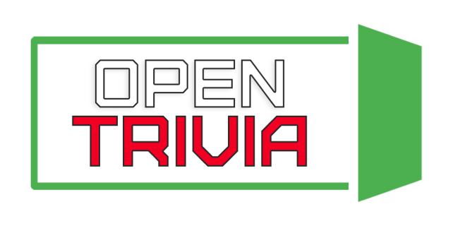

<p align="center">
  
</p>

[](https://github.com/code-monk08/opentrivia/issues) [](https://github.com/code-monk08/opentrivia/network/members) [](https://github.com/code-monk08/opentrivia/stargazers)         [](https://app.slack.com/client/T4SJVFM8C/CMYR582R4)

`THIS PROJECT IS UNDER ACTIVE DEVELOPMENT, README MAY CHANGE EVERY ONCE IN A WHILE`


## Index

- [About](#beginner-about)
- [Usage](#zap-usage)
  - [Installation](#electric_plug-installation)
  - [Commands](#package-commands)
- [File Structure](#file_folder-file-structure)
- [Guideline](#exclamation-guideline)  
- [Gallery](#camera-gallery)
- [Endpoints](#busstop-Endpoints)
- [Credit/Acknowledgment](#star2-creditacknowledgment)
- [License](#lock-license)

## About
This will be a free to use, open sourced trivia questions database which has an API implemented in Python3 & Flask using PostgresSQL database, also this will be a source for a minimal quizzing website which will also let contributors add new questions in multiple categories and as MCQ or T/F types. 

## Usage
To use this project.

### Installation
- Install dependencies & export environment variables.

```bash
$ pip3 install -r requirements.txt
$ export FLASK_APP="run.py"
$ export FLASK_ENV=development
$ export APP_SETTINGS="development"
```
### Commands
- Make sure to run this command before starting ```run.py```
```bash
$ sudo -i -u postgres
```
- Start project using
```bash
$ flask run.py
```

## File Structure
- Add a file structure here with the basic details about files, below is an example.

```
.
├── app
│   ├── api
│   │   ├── __init__.py
│   │   └── resources.py
│   ├── __init__.py
│   ├── models.py
│   └── views.py
├── config.py
├── CONTRIBUTING.md
├── LICENSE
├── logo
│   └── opentrivia.png
├── manage.py
├── README.md
├── requirements.txt
├── run.py
├── SCHEMA.md
└── test_opentrivia.py

3 directories, 15 files
```

| No | File Name | Details 
|----|------------|-------|
| 1  | app\/\_\_init\_\_.py | home for `create_app()` function definition which wraps creation of new flask object and all API endpoints.
| 2  | app\/models.py | home for models used in `OpenTrivia`. 
| 3  | app\/views.py | This module will contain the routes to our app interface.
| 4  | run.py | entry point to start our app.
| 5  | test_opentrivia.py | home for unit tests for our API.

## Guideline

- __Code Style__


In order to maintain the code style consistency across entire project we use a code formatter. Therefore, we kindly suggest you to do the same whenever you push commits to this project. 

The python code formatter we chose is called black. Black is a great tool and it can be installed quickly by running 

`pip install black`.  

or

`python3.6 -m pip install black`

It requires Python 3.6.0+ to run.


- __Usage__

`black {source_file_or_directory}`

For more details and available options, please check the [GitHub project](https://github.com/psf/black).

- __Close Issues__

Close issues using keywords: [how to ?](https://help.github.com/en/articles/closing-issues-using-keywords)

## Gallery
`Todo`

## Endpoints
`Todo`
- [ ] Add a question 
- [ ] Add answer(s) to a question
- [ ] Update a question
- [ ] Update answer(s)
- [ ] Delete a question (along with its answers)
- [ ] Delete an answer
- [ ] Get question(s)
- [ ] Get all question(s) & their answer(s)
- [ ] Get question category
- [ ] Get question level (easy | medium | hard )
- [ ] Get type of question (MCQ | T/F)

feel free to add more functionalities
endpoint url structure:  **/api/v1/. . .**

## Credit/Acknowledgment
[](https://github.com/code-monk08/opentrivia/graphs/contributors)

## License
[](https://github.com/code-monk08/opentrivia/blob/master/LICENSE)
